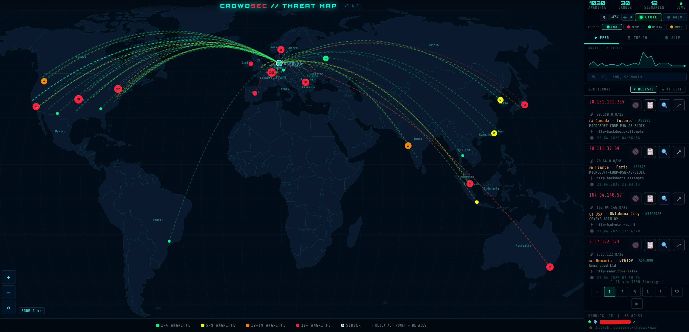

# 🛡️ CrowdSec Threat Map

**Echtzeit-Angriffskarte — direkt aus eurer lokalen CrowdSec-Datenbank**


---

## 📸 Preview

> Interaktive Weltkarte · Animierte Angriffspfeile · Live-Feed · Mobile-ready



---

## ✨ Features

- 🌍 **Interaktive Weltkarte** mit animierten Angriffspfeilen (D3.js)
- 🎯 **Auto-Fit Zoom** — alle Angriffspunkte automatisch sichtbar
- 🔍 **Echtzeit-Suche** nach IP, Land, Stadt, Szenario, ASN
- 🚫📋 **Ban-Status-Anzeige** — 🚫 aktiver Ban / 📋 nur Alert/Historie
- 🔓 **IP-Unban** direkt aus dem Dashboard — löscht Decision UND Alert
- 📊 **Sparkline** — Angriffe/Stunde auf einen Blick
- 🎨 **4 Farbthemen** — Cyan, Alarm-Rot, Matrix-Grün, Amber
- 📥 **CSV-Export** — direkt neben den Feed-Seitenzahlen
- 📱 **Vollständig responsive** — Desktop und Mobile
- 〰️ **Linien-Toggle** — Angriffspfeile & Radar-Ringe ein-/ausblenden
- 🛡️ **Dynamische IP-Whitelist** — eigene IP automatisch alle 15 Min whitelisten
- 🟢 **Whitelist-Badge** — zeigt aktuelle IP + Status live im Dashboard
- 🌐 **Sprache per Variable** — `LANGUAGE=de` oder `LANGUAGE=en` in docker-compose
- 🏙️ **Lokalisierte Stadtnamen** — Nürnberg statt Nuremberg, München statt Munich etc.
- 📍 **Korrigierte GeoIP** — Vogtland/Plauen korrekt statt falscher Grenzregion

---

## 🚀 Installation — Unraid (App Store)

### 1. App Store öffnen

Unraid → **Apps** → Suchfeld: `crowdsec-threat-map` → Installieren

### 2. Pflichtfelder ausfüllen

| Unraid | Beispiel | Beschreibung |
|------|---------|-------------|
| **Server Breitengrad** | `52.5200` | ⚠️ Pflicht — euer Breitengrad |
| **Server Längengrad** | `13.4050` | ⚠️ Pflicht — euer Längengrad |
| Pfad `/crowdsec/data` | `/mnt/user/Docker/crowdsec/data` | ⚠️ Pflicht — Pfad zu euren CrowdSec-Daten |
| Pfad `/crowdsec/postoverflows` | `/mnt/user/Docker/crowdsec/postoverflows` | Für dynamische Whitelist |
| Port `8080` | `8080` | Port für das Dashboard (frei wählbar) |

> **Koordinaten finden:** Rechtsklick auf [Google Maps](https://maps.google.com) → „Was ist hier?"

> **CrowdSec-Pfad finden:**
> ```bash
> docker inspect crowdsec | grep -A5 "Mounts"
> # → "Source": "/mnt/user/Docker/crowdsec/data"
> ```

### 3. Optionale Einstellungen

| Feld | Standard | Beschreibung |
|------|----------|-------------|
| Variable `SERVER_NAME` | `MeinServer` | Anzeigename auf der Karte |
| Variable `CROWDSEC_CONTAINER` | `crowdsec` | Name des CrowdSec-Containers |
| Variable `WHITELIST_ENABLED` | `true` | Schützt vor Selbst-Ban bei IP-Wechsel |
| Variable `LANGUAGE` | `de` | Sprache: `de` oder `en` |

### 4. Starten

Auf **Anwenden** klicken → Container startet automatisch.

Dashboard: **http://EURE-UNRAID-IP:8080**

---

## 🚀 Installation — Docker

```bash
docker run -d \
  --name crowdsec-monitor \
  --restart unless-stopped \
  -p 8080:8080 \
  -v /pfad/zu/crowdsec/data:/crowdsec/data:ro \
  -v /pfad/zu/crowdsec/postoverflows:/crowdsec/postoverflows \
  -v /var/run/docker.sock:/var/run/docker.sock:ro \
  --group-add 999 \
  -e SERVER_LAT=52.5200 \
  -e SERVER_LON=13.4050 \
  -e SERVER_NAME=Berlin \
  -e LANGUAGE=de \
  ghcr.io/kabelsalatundklartext/crowdsec-threat-map-docker:latest
```

Oder mit `docker-compose.yml` — die aktuelle Version findet ihr im Repository unter `docker/docker-compose.yml`.

---

## ⚙️ Alle Variablen

| Variable | Standard | Beschreibung |
|----------|----------|-------------|
| `SERVER_LAT` | `0.0` | ⚠️ Breitengrad des Servers |
| `SERVER_LON` | `0.0` | ⚠️ Längengrad des Servers |
| `SERVER_NAME` | `MeinServer` | Anzeigename auf der Karte |
| `LANGUAGE` | `de` | Sprache der Oberfläche: `de` oder `en` |
| `CROWDSEC_CONTAINER` | `crowdsec` | Name des CrowdSec-Docker-Containers |
| `CROWDSEC_DB_PATH` | `/crowdsec/data/crowdsec.db` | Pfad zur CrowdSec SQLite-DB |
| `CROWDSEC_MMDB_PATH` | `/crowdsec/data/GeoLite2-City.mmdb` | Pfad zur GeoIP-Datenbank |
| `CACHE_TTL` | `60` | Cache-Zeit in Sekunden |
| `DAYS_BACK` | `365` | Anzahl Tage für die Anzeige |
| `WHITELIST_ENABLED` | `true` | Dynamische Whitelist aktivieren |
| `WHITELIST_FILE` | `/crowdsec/postoverflows/`<br>`s01-whitelist/my-whitelist.yaml` | Pfad zur Whitelist-YAML |
| `WHITELIST_INTERVAL` | `900` | Prüfintervall in Sekunden (15 min) |
| `CROWDSEC_RESTART_WAIT` | `15` | Wartezeit nach CrowdSec-Neustart (Sek.) |

---

## 📦 Volumes

| Host-Pfad | Container-Pfad | Beschreibung | Pflicht? |
|-----------|---------------|-------------|---------|
| `/pfad/zu/crowdsec/data` | `/crowdsec/data:ro` | CrowdSec DB + GeoIP-MMDB | ✅ Ja |
| `/pfad/zu/crowdsec/postoverflows` | `/crowdsec/postoverflows` | Für dynamische Whitelist | Nur wenn `WHITELIST_ENABLED=true` |
| `/var/run/docker.sock` | `/var/run/docker.sock:ro` | Für IP-Unban + Whitelist-Neustart | Nur für Unban-Button |

> **Unraid-Beispielpfade:**
> - `/mnt/user/Docker/crowdsec/data`
> - `/mnt/user/Docker/crowdsec/postoverflows`

---

## 🛡️ Dynamische IP-Whitelist

Heimanschlüsse bekommen meist täglich eine neue IP. Ohne Whitelist kann CrowdSec euch selbst bannen. Der eingebaute Hintergrund-Thread prüft alle 15 Minuten eure aktuelle öffentliche IP und aktualisiert die Whitelist-YAML automatisch.

**Voraussetzungen:**
- `WHITELIST_ENABLED=true` (Standard)
- Volume `/crowdsec/postoverflows` eingebunden
- `/var/run/docker.sock` eingebunden
- Docker-GID korrekt gesetzt (`--group-add 999` bzw. in Unraid über `group_add`)

**Wie es funktioniert:**
1. Exporter ermittelt eure aktuelle öffentliche IP
2. Vergleich mit der aktuellen Whitelist-YAML
3. Bei Änderung: YAML wird aktualisiert, CrowdSec wird neu gestartet
4. Wartezeit nach Neustart konfigurierbar via `CROWDSEC_RESTART_WAIT`

**Dashboard-Badge:**

| Farbe | Bedeutung |
|-------|-----------|
| 🟢 Grün | IP gewhitelistet, alles ok |
| 🔵 Cyan | IP wurde gerade aktualisiert |
| 🔴 Rot | Fehler beim Update |

---

## 🔓 IP-Unban

Jeder Feed-Eintrag zeigt den Ban-Status direkt an:

| Icon | Bedeutung | Klick |
|------|-----------|-------|
| 🚫 (leuchtend) | Aktiver Ban vorhanden | Decision + Alert löschen |
| 📋 (leuchtend) | Nur Alert/Historie | Nur Alert löschen |

---

## 🗺️ GeoIP & Stadtanzeige

Ohne GeoIP-Datenbank werden keine Städte angezeigt, nur Länderpunkte.

**GeoLite2-City.mmdb einrichten:**
1. Kostenlos registrieren: [MaxMind GeoLite2](https://www.maxmind.com/en/geolite2/signup)
2. `GeoLite2-City.mmdb` herunterladen
3. In euren CrowdSec-Datenordner legen (gleicher Ordner wie `crowdsec.db`)
4. Container neu starten

---

## 🛠️ Fehlerbehebung

**Dashboard leer / keine Daten:**
```bash
docker logs crowdsec-monitor
curl http://EURE-IP:8080/metrics | head -10
```

**Falscher CrowdSec-Pfad:**
```bash
docker inspect crowdsec | grep -A5 "Mounts"
```

**Unban funktioniert nicht:**
```bash
# Docker-GID prüfen
getent group docker | cut -d: -f3
# → In Unraid unter "Extra Parameters" als --group-add eintragen
```

**Whitelist-Fehler:**
```bash
curl http://EURE-IP:8080/whitelist-status
```

**Dashboard zeigt Verbindungsfehler:**
```bash
# Prüfen ob entrypoint.sh die URL korrekt gesetzt hat
docker exec crowdsec-monitor grep "EXPORTER_URL" /var/www/html/index.html
# → Sollte '/metrics' zeigen
```

---

## 📋 Changelog

Vollständige Versionshistorie → [CHANGELOG.md](CHANGELOG.md)

---

## 🔗 Links

- [MaxMind GeoLite2](https://www.maxmind.com/en/geolite2/signup) — kostenlose GeoIP-Datenbank
- [CrowdSec Docker Hub](https://hub.docker.com/r/crowdsecurity/crowdsec)
- [CrowdSec Docs](https://docs.crowdsec.net)

---

## 📄 Lizenz

**GNU General Public License v3.0 (GPL-3.0)**

| | |
|--|--|
| ✅ Privat & Homelab nutzen | ✅ Verändern & anpassen |
| ✅ Weitergeben & teilen | ✅ Eigene Versionen veröffentlichen |
| ✅ Kommerzieller Einsatz erlaubt | ❌ Closed-Source-Abwandlungen verboten |
| ✅ Forks müssen GPL-3.0 bleiben | ✅ Quellcode muss immer offen bleiben |

Bei Weitergabe oder Veröffentlichung: Namensnennung + GPL-3.0-Lizenz beibehalten.
> *"CrowdSec Threat Map" von kabelsalatundklartext — [GitHub](https://github.com/kabelsalatundklartext/crowdsec-threat-map-docker)*
